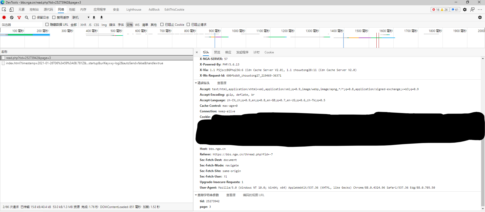

# NGA-MoFish

让你可以在vscode看NGA摸鱼

- 仓库地址：[github.com](https://github.com/DarrenIce/NGA-MoFish)
- 插件地址：[marketplace.visualstudio.com](https://marketplace.visualstudio.com/items?itemName=DarrenB.nga-mofish)
- 更新日志：[CHANGELOG](https://github.com/DarrenIce/NGA-MoFish/blob/master/CHANGELOG.md)

---

## 功能

- [x] 自定义添加分区
- [x] 浏览分区帖子（可以指定查看帖子数量啦）
- [x] 查看AC娘表情
- [x] 打开指定tid
- [x] 只看楼主（感谢呦哥@Exceedingly0代码） 

## 第一次使用

1. 浏览器打开NGA并登录之后，按`F12`打开DevTools，切到`Network(网络)`页，刷新一下页面，可以看到有类似于这样的url，在请求标头中找到cookie，复制

2. 打开NGA扩展，点击上方的登录按钮，粘贴刚才复制的cookie在上方的输入提示框中，回车即可
3. 添加分区，例如水区的url是`https://bbs.nga.cn/thread.php?fid=-7`，那么水区的fid就是`-7`，点击上方的添加分区按钮，输入`-7`即可添加水区，其他分区也是同理

## 反馈

欢迎PR或提交issue

## 感谢

感谢项目[v2ex-playground](https://github.com/chaselen/v2ex-playground)