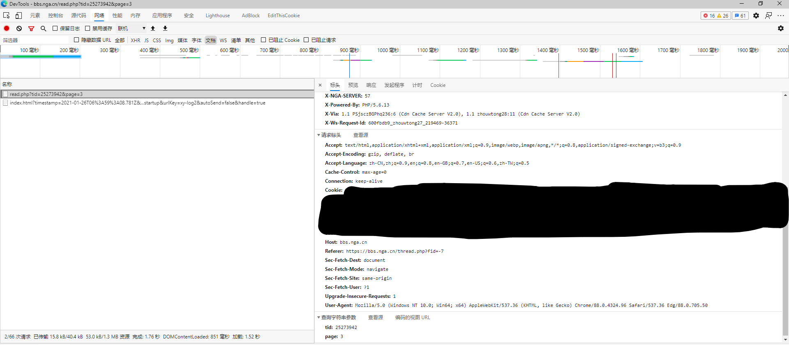

# NGA-MoFish

让你可以在vscode看NGA摸鱼

- 仓库地址：[github.com](https://github.com/DarrenIce/NGA-MoFish)
- 插件地址：[marketplace.visualstudio.com](https://marketplace.visualstudio.com/items?itemName=DarrenB.nga-mofish)
- 更新日志：[CHANGELOG](https://github.com/DarrenIce/NGA-MoFish/blob/master/CHANGELOG.md)

---

## 功能

- [x] 自定义添加分区
- [x] 浏览分区帖子
- [x] 查看AC娘表情
- [x] 打开指定tid
- [x] 只看楼主（感谢呦哥@Exceedingly0） 
- [x] 无图模式、小图模式、标准模式（无图模式下点击占位可加载图片）
- [x] Markdown 编辑器、TypeScript 源码、PowerShell 终端三套 VS Code 风格帖子主题
- [x] 基于公开历史回帖生成用户画像，支持自定义 OpenAI-compatible 模型
- [x] 帖子搜索，支持搜索结果翻页
- [x] 一键获取个人收藏的版块（感谢[ys152452](https://github.com/ys152452)PR）
- [x] 对帖子or回复进行点赞👍
- [x] 支持普通回帖、引用回帖、回复指定楼层和贴条回帖，带表情、常用 BBCode 与发送前预览
- [x] 可以对别人贴标签啦，点击别人ID即可添加新标签，点击已添加的标签即可删除标签
- [x] 收藏帖子、同步NGA收藏
- [x] 设置代理、自定义nga域名

## TODO

- [ ] 导入导出配置文件

## 第一次使用

1. 浏览器打开NGA并登录之后，按`F12`打开DevTools，切到`Network(网络)`页，刷新一下页面，可以看到有类似于这样的url，在请求标头中找到cookie，复制

2. 打开NGA扩展，点击上方的登录按钮，粘贴刚才复制的cookie在上方的输入提示框中，回车即可
3. 点击同步按钮，即可同步NGA收藏节点
4. 添加分区，例如水区的url是`https://bbs.nga.cn/thread.php?fid=-7`，那么水区的fid就是`-7`，点击上方的添加分区按钮，输入`fid=-7`即可添加水区，其他分区也是同理
5. 根据喜好设定图片模式、帖子主题、标题大小、是否过滤已读帖子

### 用户画像分析

1. 在 NGA 扩展视图右上角打开“设置” → “模型配置”。
2. 配置 `Base URL` 和 `Model Name`；`Base URL` 可以填写 API 根地址（如 `https://api.example.com/v1`），也可以直接填写完整的 `/chat/completions` 地址。
3. 按需设置 `API Key`。密钥保存在 VS Code `SecretStorage` 中，不会写入普通配置或传入帖子 Webview；无需鉴权的本地兼容服务可以不设置。
4. 使用“测试 /chat/completions”真实验证接口、模型名以及 `choices[0].message.content` 响应结构。
5. 打开帖子后，点击作者名旁的“画像”即可抓取最多 5 页公开历史回帖并生成报告。

## 反馈

欢迎PR或提交issue

## 感谢

感谢项目[v2ex-playground](https://github.com/chaselen/v2ex-playground)
